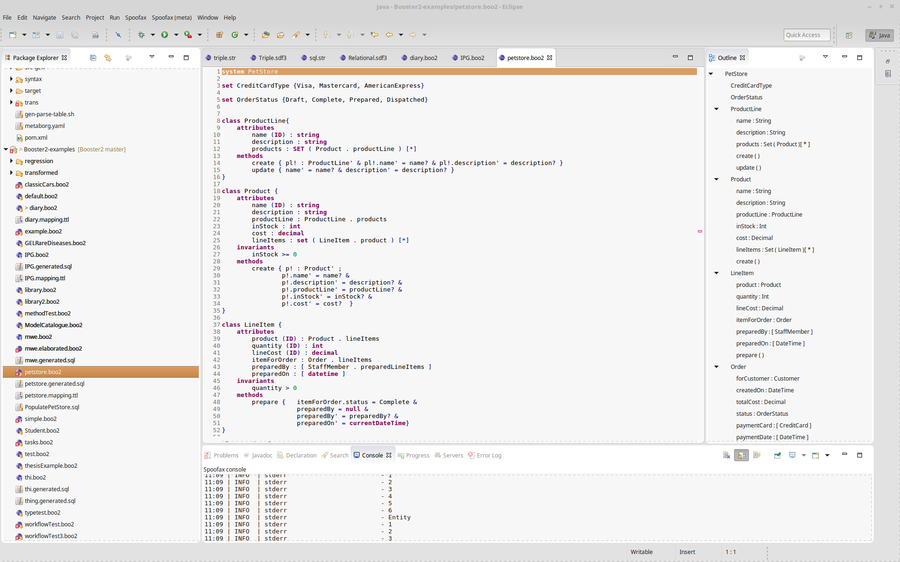
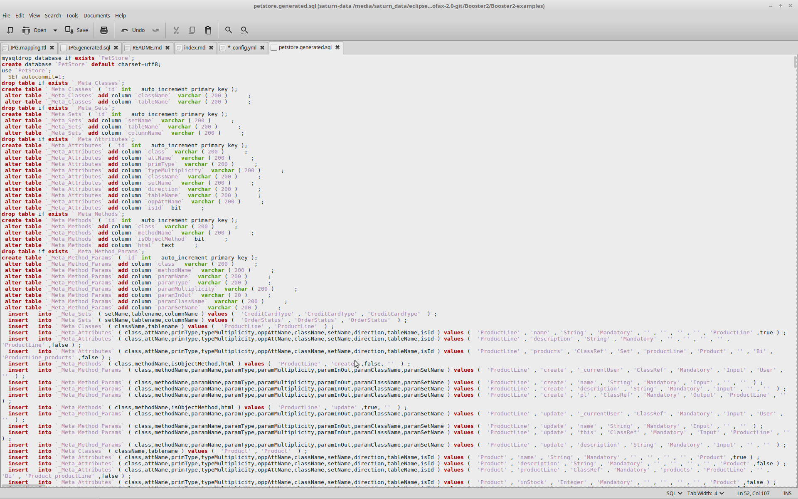
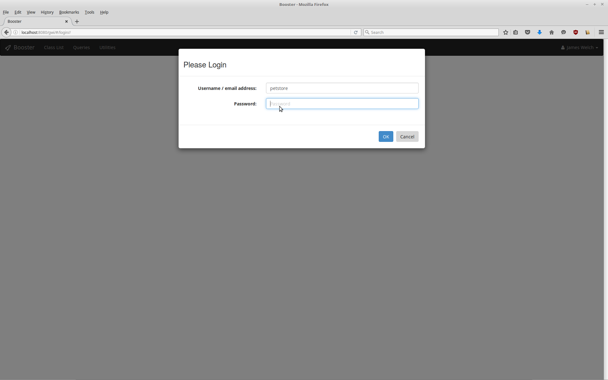
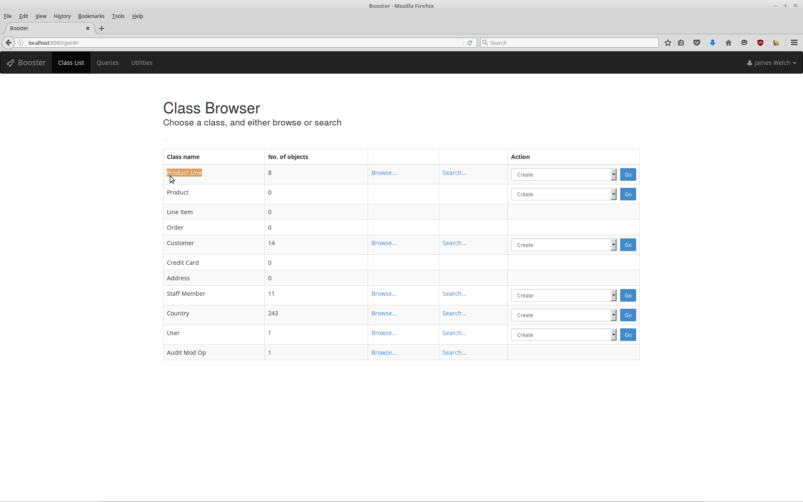
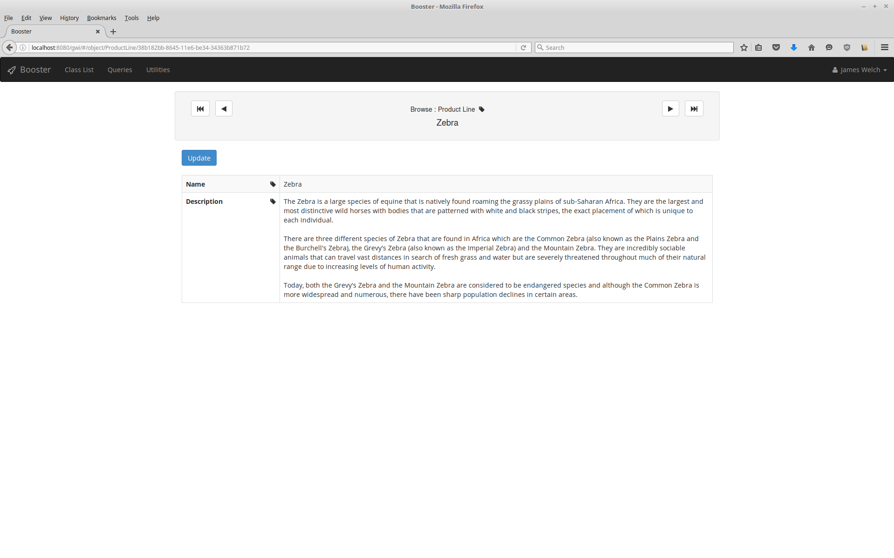
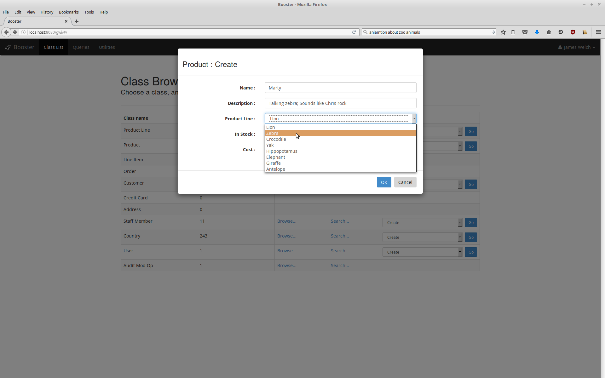

<div style="text-align:center;margin:0 10px 10px 0" markdown="1">
{:width="200px"}
</div>

## What is Booster2?

B Object Oriented STate-based Refinement or Booster is a notation and supporting tool for converting system specifications into online information systems. This implementation, Booster2, uses revised underlying architecture. The revised tool generates standard SQL schemas and stored procedures, and is defined using the Spoofax language workbench. This is in contrast with the original implementation which created Abstract Machines for the B-Toolkit and resulted in C code with an in-memory database.

Booster2 is designed for information systems where the specification is expected to evolve in response to changing requirements. In typical development, requirements changes after software delivery involve costly and lengthy redesign processes. Changes to specification are reflected in new generated implementation. Booster uses a standard entity notation for classes and attributes. Specifications are created with invariants, and method specified as pre- and post- conditions. The tool generates database schemas, stored procedures, an API and a user interface from a high-level system specification.

## Booster Notation


## Screenshots

{:width="300px"}

{:width="300px"}

{:width="300px"}

{:width="300px"}

{:width="300px"}

{:width="300px"}

## Install Instructions

### Docker Image

- Install Docker
- Clone the Booster Docker repository
- Copy a Booster2 specification into files/
- build the Docker image
```docker build . -t `whoami`/booster2:proto```
- run the docker image
```docker run -p 80:8080  -v `pwd`/files:/files `whoami`/booster2:proto myboosterspec.boo2```
- (optional) copy a database populate script into files/
- navigate to [http://localhost:80/gwi](http://localhost:80/gwi) login to browse your data
- login and password are set to the system name

To get an Eclipse based Booster2 editor and translator, follow the developer steps below.

### Developers

- Install the Spoofax 2.0.0-beta Eclipse distribution
- Clone the Booster 2.0 repository
- Import the Booster2 folder (as a Maven project) into your Spoofax Eclipse
- install maven 3.3.9 and configure Eclipse to use it, the embedded Maven has a sl4j bug.
- (optional) Install Jave EE into your Eclipse 
- (optional) Install Tomcat and integrate with Eclipse 
- (optional) Install MySQL 5.6

## People

People who have contributed to the project.

- James Welch
- Daco Harkes
- Ed Crichton
- [Seyyed Shah](http://sshah.co.uk)

## Technology

- Metaborg Spoofax Language Workbench
- MySQL
- Apache Tomcat

## Funding

The development of Semantic Booster been supported by the [ALIGNED](http://aligned-project.eu/)
Project, a European Union Horizon 2020 Framework project. Number: #644055.


